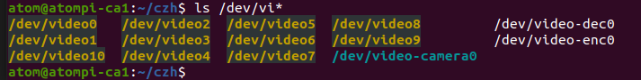

# rk3568-smart-vision-system-
A smart vision edge computing system based on Rockchip RK3568
#### 获取摄像头设备号
```bash
ls /dev/vi*
```

根据拔插摄像头，获得设备号，当前摄像头设备号为：/dev/video9

#### v4l2设置摄像头的曝光
##### 手动设置
```bash
v4l2-ctl -d /dev/video9 -c exposure_auto=3          # exposure_auto设置为3为自动模式
v4l2-ctl -d /dev/video9 -c exposure_auto=1          # exposure_auto设置为1为手动模式
v4l2-ctl -d /dev/video9 -c exposure_absolute=2600   # 设置为手动模式后调整曝光度
```

#### 交叉编译其他库（SDL库为例）
- github下载SDL库源文件
- 交叉编译流程：
```bash
# 下载SDL其他版本的源码，比如SDL-release-2.30.8
# 创建一个build文件夹
mkdir build
# --host不是编译器地址，理解为交叉编译器的版本和厂商
# --prefix是install文件夹的地址，最好用绝对路径
../configure --host=aarch64-rockchip1031-linux-gnu --prefix=/home/alientek/czh/SDL-release-2.30.8/install
make -j8
make install
# 查看install文件夹是否有相关文件
cd ../install
# 应该有相关libSDL-x.x.so等文件
ls -la lib/
# 设置环境变量
export SDL_INSTALL_DIR="/home/alientek/czh/SDL-release-2.30.8/install"
# 编译命令
aarch64-rockchip1031-linux-gnu-gcc -I${SDL_INSTALL_DIR}/include xxx.c -o xxx -L${SDL_INSTALL_DIR}/lib -lSDL2
```